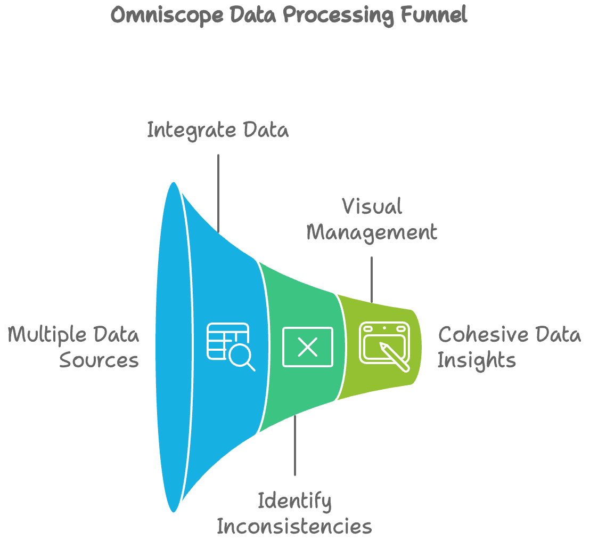

# Omniscope

Omniscope is a powerful tool developed by EximiaCo with the goal of integrating information from various sources into a single system, ensuring that data is consistent and accessible.

  

## Flexibility and Expansion

The specific tools mentioned above are not the focus, as Omniscope is designed to be flexible and adaptable. New tools can be easily integrated as EximiaCo's needs evolve. For example, we are integrating YouTube as a content source, along with Instagram.

## Requesting a Feature or Reporting a Bug

If you want to request a new feature or report a bug, please do so by opening an Issue on GitHub.

Before submitting a new Issue, we recommend that you:

1. **Search for Existing Issues:** Check if there is already an open Issue related to the feature or bug you are addressing. This helps prevent duplicates and keeps discussions consolidated.

2. **Use the GPT for Writing Issues:** If no related Issue exists, you can use the GPT developed specifically for writing Issues at [this link](https://chatgpt.com/g/g-4EhDdFCI4-gpt-redator-de-issues-para-um-projeto-de-software). This tool will guide you through the process of creating a clear and effective Issue for the project.

When submitting your Issue:

3. **Submit Your Issue on GitHub:** Once your Issue is written, submit it on the appropriate GitHub repository. Make sure to select the relevant labels that best describe the nature of your Issue (e.g., `bug`, `enhancement`, `question`). This helps maintainers prioritize and manage the Issues more effectively.

4. **Stay Updated:** After submitting your Issue, keep an eye on any updates. Project maintainers may request additional information or clarification to help address the Issue more effectively.

Following these steps helps ensure that your request is communicated clearly and increases the likelihood of it being addressed promptly.

## Contributing

If you wish to contribute to the development of Omniscope, please follow the guidelines outlined in the `CONTRIBUTING.md` document.

---

Omniscope is an example of how EximiaCo continues to innovate and lead in data integration and the creation of intelligent business solutions.
