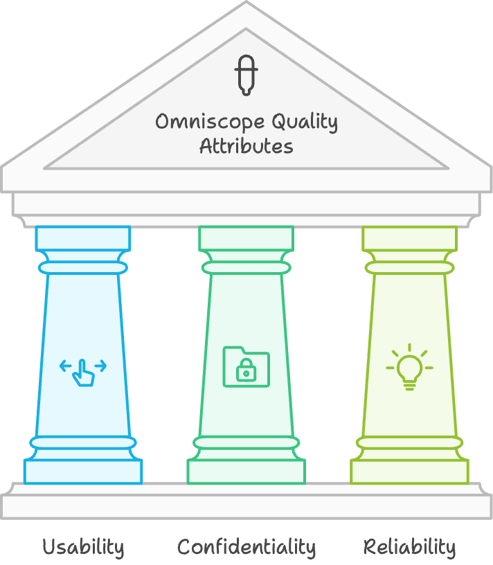

# Omniscope Architecture Haiku

## Objective

- Integrate information from multiple sources to provide a unified and cohesive data view.
- Identify data inconsistencies. 
- Enable visual management for informed analyses and decision-making.

## Functional Requirements

- Dashboards:
  - Contextualized views of critical data. 
  - Lists of clients, employees, and work volumes categorized by periods. 
  - Designed for quick and accurate critical analyses. 
- Inconsistency Identifiers:
  - Automatic detection of inconsistencies in data entries.
  - Unrelated or unidentified data. 
- Workbenches:
  - Practical and personalized workspaces for each EximiaCo employee.
  - Customized indicators
  - Gamification

  

## Technical Constraints
- Adapt to different APIs and data formats for each integrated system. 
- Manage specific technical aspects such as:
  - Rate limits 
  - Usage quotas 
  - Authentication protocols 
- Ensure secure and reliable data exchange between systems.

## Quality Attributes
- Prioritized as follows:
  - **Usability**: Intuitive and easy to use. 
  - **Confidentiality**: Protect sensitive information and ensure regulatory compliance. 
  - **Reliability**: Ensure system stability and consistent operation.

  

## Design Decisions

Technologies Chosen:

- Next.js for frontend development, providing a robust React-based framework
- GraphQL for efficient API communication between frontend and backend
- Python for backend development, maintaining data processing capabilities
- Pydantic for data validation and GraphQL schema generation
- Tailwind CSS for flexible and customizable UI styling

System Data Architecture:

- Frontend Layer: Next.js-based React application
- GraphQL Layer: Facilitates communication between frontend and backend
- Backend Layers:
  - Syntactic Layer: Interface with external APIs
  - Semantic Layer: Translate data into a common language
  - Domain Layer: Manage data relationships and business logic
  - Dataset Layer: Expose and analyze data

User Interface:

- Tailwind CSS adopted for consistent and customizable visual components
- Custom React components for specific UI needs
- Ongoing UI revisions to improve user experience

Authentication:

- Google Authentication implemented for secure and streamlined user access

Future Plans:

- Continuous improvement of the GraphQL API for more efficient data fetching
- Enhancement of analytics components for better data visualization
- Exploration of server-side rendering capabilities in Next.js for improved performance
