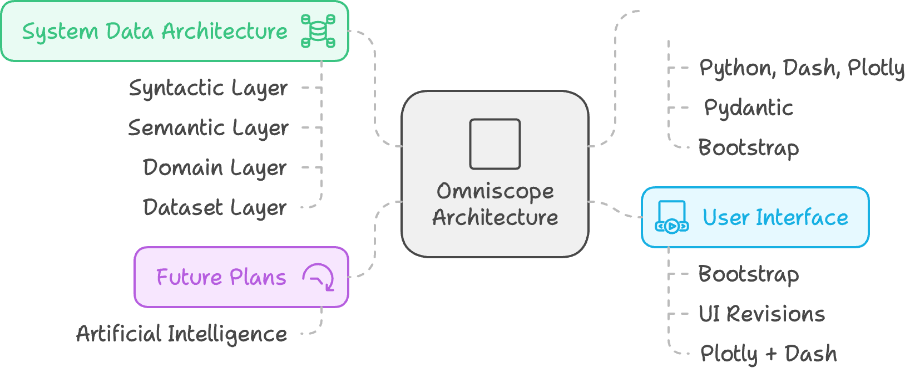

# Omniscope Architecture Haiku

## Objective

- Integrate information from multiple sources to provide a unified and cohesive data view.
- Identify data inconsistencies. 
- Enable visual management for informed analyses and decision-making.

## Functional Requirements

- Dashboards:
  - Contextualized views of critical data. 
  - Lists of clients, employees, and work volumes categorized by periods. 
  - Designed for quick and accurate critical analyses. 
- Inconsistency Identifiers:
  - Automatic detection of inconsistencies in data entries.
  - Unrelated or unidentified data. 
- Workbenches:
  - Practical and personalized workspaces for each EximiaCo employee.
  - Customized indicators
  - Gamification

  

## Technical Constraints
- Adapt to different APIs and data formats for each integrated system. 
- Manage specific technical aspects such as:
  - Rate limits 
  - Usage quotas 
  - Authentication protocols 
- Ensure secure and reliable data exchange between systems.

## Quality Attributes
- Prioritized as follows:
  - **Usability**: Intuitive and easy to use. 
  - **Confidentiality**: Protect sensitive information and ensure regulatory compliance. 
  - **Reliability**: Ensure system stability and consistent operation.

  

## Design Decisions

Technologies Chosen:

- Python, Dash, and Plotly for ease of development in data visualization.
- Pydantic for ensuring a strongly typed model whenever possible. 
- Bootstrap for UI consistency

System Data Architecture:

- Syntactic Layer: Interface with external APIs.
- Semantic Layer: Translate data into a common language. 
- Domain Layer: Manage data relationships and business logic. 
- Dataset Layer: Expose and analyze data.

User Interface:

- Bootstrap adopted for minimum consistency in visual components. 
- Ongoing UI revisions due to the absence of dedicated designers. 
- Plotly + Dash for dashboards

Future Plans:

- Introduction of Artificial Intelligence to accelerate analyses and inferences.
 

  

